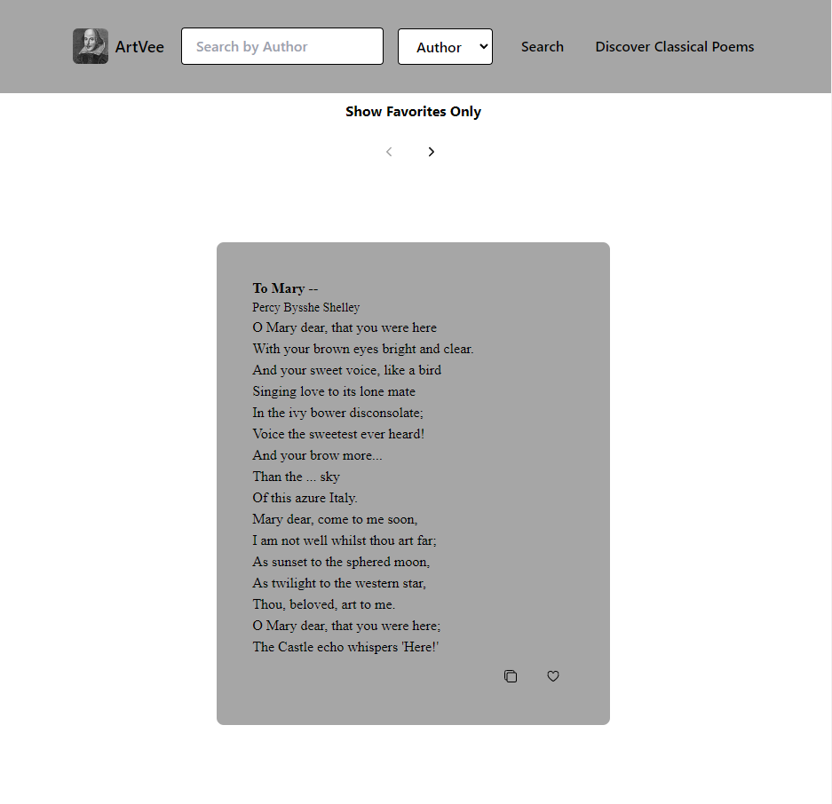

# PoemsVee

Este é um aplicativo React simples que permite buscar e exibir poesias clássicas. Você pode buscar pelo autor ou título do poema.

## Recursos

- **Busca:**
  - Insira o termo de busca no campo de texto.
  - Escolha o tipo de busca entre autor ou título.
  - Clique no botão "Buscar" para iniciar a busca.

- **Exibição:**
  - Exibe os resultados da busca em uma lista.
  - Paginação para navegar por diferentes páginas de poesias.

- **Favoritos:**
  - Alternar entre mostrar todas as poesias e mostrar apenas as favoritas.
  - Adicione ou remova poesias dos favoritos.

- **Ações nas Poesias:**
  - Copie o texto de um poema para a área de transferência.
  - Adicione ou remova poesias dos favoritos.

## Como Usar

1. Clone este repositório para a sua máquina local.
2. Navegue até o diretório do projeto.
3. Instale as dependências usando `npm install`.
4. Inicie o servidor de desenvolvimento com `npm start`.
5. Abra o seu navegador e vá para `http://localhost:3000`.

## Componentes

### SearchInput

Este componente fornece um formulário de busca onde você pode inserir o termo de busca e escolher o tipo de busca (autor ou título). Clicar no botão "Buscar" inicia a busca.

### PoetryDisplay

Este componente exibe os resultados da busca e inclui os seguintes recursos:

- Paginação para navegar por páginas.
- Botão de alternância para mostrar todas as poesias ou mostrar apenas as favoritas.
- Botão de cópia para copiar o texto do poema para a área de transferência.
- Botão de coração para adicionar ou remover poesias dos favoritos.

## Dependências

- React
- react-dom
- react-scripts

## API Utilizada

O aplicativo busca dados de poesia na API PoetryDB: [https://poetrydb.org/](https://poetrydb.org/)

## Créditos

- Logo: [Ícone de Shakespeare](../../public/assets/images/shakespeare-icon.jpg)

## Licença

Este projeto está licenciado sob a Licença MIT - consulte o arquivo [LICENSE](LICENSE) para mais detalhes.
